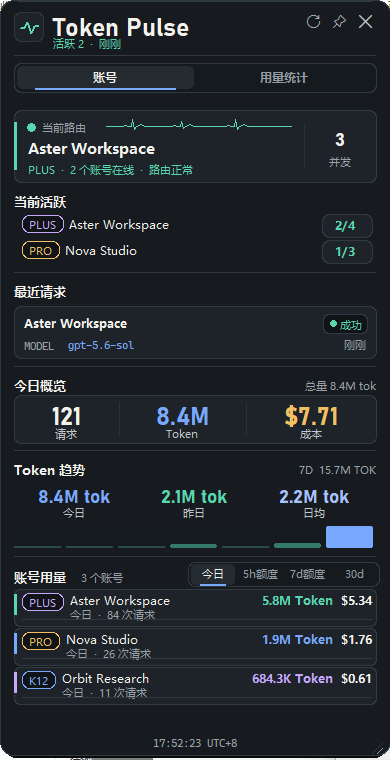
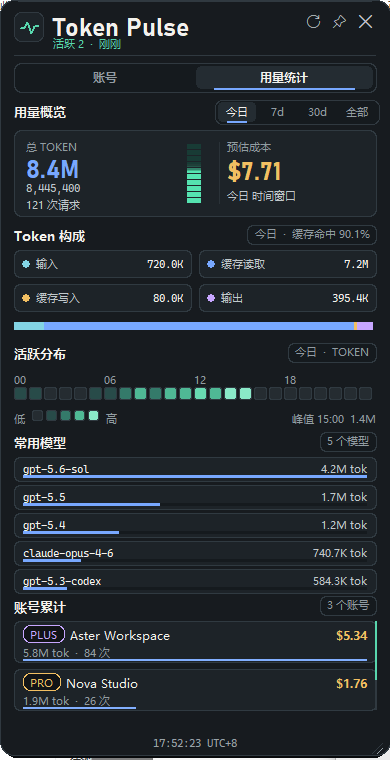

# Token Floating Monitor

一个轻量级 Windows Token 悬浮窗，用 Python/Tk 写成，不需要额外 Python 依赖。它可以在桌面上显示当前活跃账号、并发、今日请求量、Token、成本、账号额度窗口，以及更细的用量统计面板。

> 截图使用脱敏演示数据生成，仅用于展示界面结构和功能。

## 界面预览

### 账号

显示当前活跃账号、最近请求、今日统计、Token 趋势和账号用量排行。支持 `今日 / 5h / 7d / 30d` 切换。



### 用量统计

提供 `今日 / 7d / 30d / 全部` 视图，包含 Token 构成、缓存命中率、活跃分布、常用模型和账号累计成本。



## 主要功能

- 桌面悬浮窗：支持置顶、拖动、缩放、刷新和关闭。
- 两个中文页签：`账号`、`用量统计`。
- 活跃账号与并发：显示当前正在使用的账号，以及总并发/账号并发。
- 实时用量刷新：后台以冷热双层轮询观察 Codex 会话日志，活跃时只快速检查少量热文件，空闲后自动降频，并用低频全目录扫描补漏；发现新的 `token_count` 后先即时更新界面，再由完整导出结果校正。
- Token 流量脉冲：账号页将每个新增 `token_count` 绘制为从左向右移动的心电图脉冲，Token 越多波峰越高，约 10 秒走完整条轨迹；用量统计页使用单列分段流量柱，柱身保持亮色，仅柱顶约 8 像素渐变并以约 60 FPS 连续升降。两处均展示最近 10 秒 Token 流量。
- 账号排行：按今日、5h额度、7d额度、30d查看账号用量与额度状态；“额度”命名用于和用量统计中的滚动时间范围区分。
- 额度窗口：展示 5h、7d、cycle 的剩余百分比、已用比例、重置时间、无额度和 stale 状态。
- 用量统计：展示请求数、Token、成本、input/cache/output 构成、缓存命中率、常用模型和账号累计成本。
- 活跃分布：支持今日、7d、30d、全部，不同强度颜色表示用量高低；今日视图按 00:00 至当前的小时分布展示，发生 Codex 任务或持续网络错误的小时显示为红色，即使该小时同时存在成功 Token 用量。鼠标悬停可查看具体值和错误摘要；窄窗口的全部视图聚焦最近 30 天。
- 本地历史：记录每日请求、Token 和成本快照，用于趋势和历史统计。
- 去重逻辑：保留 Codex fork replay 去重和 Sub2API mirror 扣除；Cockpit API 服务模式以去重后的
  原始请求为权威总量，`api-service-local` / `codex_local_access_runtime` 仅合并为一个展示项，不再重复扣除。

## 运行要求

- Windows
- Python 3.10+
- Tkinter，Windows 官方 Python 通常自带

项目不需要安装额外 Python 包。

## 快速开始

自动模式会先检测当前 Codex endpoint。只有当前账号指向 Sub2API 地址时，才读取 Sub2API 管理端数据；切回官方账号或其他 API 时，只读取本地客户端日志：

```powershell
.\start-monitor.ps1
```

只读取本地客户端日志：

```powershell
.\start-local-codex.ps1
```

也可以直接运行：

```powershell
python .\monitor.py
```

## 本地独立监控

Cockpit 不是必需依赖。直连官方账号时，Token Pulse 会解析 Codex 官方 `~/.codex/auth.json`（包括 JWT 邮箱和 `tokens.account_id`），并按认证文件修改时间记录手动切换边界。切换前已经开始、切换后才完成的任务仍归原账号；切换后开始的新任务归新账号。只有活动 provider 明确为 Cockpit API 服务时，才读取 `.cockpit_codex_auth.json` 和 Cockpit 请求日志，卸载后的遗留文件不会覆盖官方账号身份。

账号套餐类型在首次识别后会保存到 Token Pulse 自己的 `client_usage_account_types.json`。程序也会一次性迁移 Cockpit 仍保留的账号清单备份和 sidecar 认证备份；以后即使账号从 Cockpit 删除、切换到其他账号或没有安装 Cockpit，历史账号仍保留最后一次确认的 K12、PLUS、PRO 等类型。该文件只保存在本地并默认忽略 Git 提交。

实时 Token 增量会保存到本地 `client_usage_live_checkpoint.json`，并在启动时按权威快照的固定时间截点补齐缺口。进程重启不会再退回旧总量；补扫事件与实时事件使用同一事件标识去重。持续活跃时仍采用轻量文件尾监听，不会因每个 Token 事件启动完整导出。

悬浮窗默认每秒轻量检查一次认证身份。检测到手动切号时只追加一条切换时间记录并刷新活跃账号，不扫描会话日志，也不立即触发完整 Token 导出。

如果希望完全不碰 Sub2API，可以强制本地独立模式。这个模式只读取本机 Codex/Claude 与 Antigravity Cockpit 本地日志，不请求 Sub2API 管理接口，也不使用 Sub2API 的最近请求、账号统计或并发数据。

```env
TOKEN_MONITOR_MODE=local-codex
```

### 官方额度时间同步

Token Pulse 会先读取 Cockpit 明文账号快照和 sidecar reserve 中的本地额度、重置时间；只有本地重置时间缺失或 stale 时，才使用 Cockpit 侧车维护的账号凭据请求 ChatGPT 官方 `wham/usage` 接口。程序只缓存解析后的 5h/7d/cycle 额度和重置时间，不会把 access token 写入日志、导出 JSON 或缓存文件。

每个账号默认缓存 10 分钟；请求失败也会等待 10 分钟再重试，并继续显示最后一次成功的官方百分比或本地 reserve 百分比，同时标记“额度待刷新”，不会用空值清除旧额度。可通过环境变量调整或关闭：

Token 任务持续运行时会每 10 秒执行一次轻量额度同步：先读取 Cockpit 本地快照，再复用上述 10 分钟官方缓存。百分比或重置周期发生变化时会补做一次完整窗口统计；即使会话持续繁忙，完整账号窗口快照最多保留 10 分钟，避免百分比已更新而 Token/成本仍停在旧周期。

```env
CLIENT_USAGE_OFFICIAL_QUOTA_CACHE_SECONDS=600
CLIENT_USAGE_OFFICIAL_QUOTA_REFRESH=1
TOKEN_PULSE_QUOTA_REFRESH_SECONDS=10
TOKEN_PULSE_FULL_USAGE_MAX_STALE_SECONDS=600
```

如果 `.env` 里写着 `SUB2API_MONITOR_MODE=auto`，程序会按“当前 endpoint 门禁”处理：当前 Codex 指向 Sub2API 才读 Sub2API，否则走本地日志。

## Sub2API 兼容模式

显式设置为 `sub2api` 时，悬浮窗会强制请求 Sub2API 管理端接口，适合你确认当前环境就是 Sub2API 时使用：

```env
SUB2API_MONITOR_MODE=sub2api
SUB2API_BASE_URL=http://127.0.0.1:8080
SUB2API_ADMIN_EMAIL=admin@sub2api.local
SUB2API_ADMIN_PASSWORD=your-password
```

如果你的 Sub2API 有多个本地访问地址，可以配置匹配地址：

```env
SUB2API_MATCH_BASE_URLS=http://127.0.0.1:8080,http://localhost:8080
```

## 本地客户端日志模式

本地模式会扫描本机客户端日志并生成 `client_usage_today.json` 作为当天统计缓存。默认扫描路径包括：

- `%USERPROFILE%\.codex\sessions`
- `%USERPROFILE%\.claude\projects`

常用配置：

```env
SUB2API_MONITOR_MODE=local-codex
CLIENT_USAGE_CODEX_DEFAULT_MODEL=gpt-5.5
CLIENT_USAGE_MAX_SINGLE_EVENT_TOKENS=2000000
CLIENT_USAGE_CODEX_DESKTOP_LOG_ROOT=
CLIENT_USAGE_MODEL_PRICE_CACHE_SECONDS=86400
CLIENT_USAGE_OFFLINE_BACKFILL_MAX_DAYS=31
SUB2API_CLIENT_USAGE_EXPORT_TIMEOUT_SECONDS=90
TOKEN_PULSE_LIVE_USAGE_WATCH_INTERVAL_MS=100
TOKEN_PULSE_LIVE_USAGE_WATCH_IDLE_INTERVAL_MS=250
TOKEN_PULSE_LIVE_USAGE_WATCH_COLD_INTERVAL_MS=500
TOKEN_PULSE_LIVE_VERIFY_THRESHOLD_TOKENS=50000000
TOKEN_PULSE_LIVE_VERIFY_WINDOW_SECONDS=5
TOKEN_PULSE_LIVE_USAGE_EXPORT_IDLE_SECONDS=30
TOKEN_PULSE_AUTH_SWITCH_WATCH_INTERVAL_MS=1000
SUB2API_INCLUDE_LOCAL_USAGE=false
SUB2API_MONITOR_USAGE_SOURCE=auto
```

`CLIENT_USAGE_MAX_SINGLE_EVENT_TOKENS` 用来过滤异常大的单次 token 事件。

运行过程中，实时增量在 5 秒内累计达到 `TOKEN_PULSE_LIVE_VERIFY_THRESHOLD_TOKENS`（默认 `50,000,000`）时不会立即加入今日总量，而是先触发只读完整扫描；扫描截止时间覆盖这批事件后，才按去重后的权威结果更新。可通过 `TOKEN_PULSE_LIVE_VERIFY_WINDOW_SECONDS` 调整累计窗口。软件刚启动时从历史日志恢复当日用量不经过这项运行期防护，因此不会把正常的启动加载误判为突增。

实时监听采用自适应冷热双层轮询：有日志活动时按 `TOKEN_PULSE_LIVE_USAGE_WATCH_INTERVAL_MS`（默认 `100` 毫秒）检查最多 16 个热文件；空闲 10 秒后使用 `TOKEN_PULSE_LIVE_USAGE_WATCH_IDLE_INTERVAL_MS`（默认 `250` 毫秒），空闲 60 秒后使用 `TOKEN_PULSE_LIVE_USAGE_WATCH_COLD_INTERVAL_MS`（默认 `500` 毫秒）。程序每 20 秒只遍历一次完整目录以补充新文件，不重复读取历史日志内容。即时层只在内存中更新顶部 Token/请求总量和今日 Token 构成，不写入 provider、模型、成本、Activity、历史或统计缓存；随后仍由原有后台完整解析、fork replay 去重、账号归属和计费流程生成权威结果。

`TOKEN_PULSE_LIVE_USAGE_EXPORT_IDLE_SECONDS` 默认为 `30` 秒。活跃会话仍在写日志时，常规完整扫描会暂缓；日志安静达到该时间后再更新账号归属、模型和成本。额度周期变化或完整快照超过 `TOKEN_PULSE_FULL_USAGE_MAX_STALE_SECONDS`（默认 10 分钟）时仍会强制校正一次，悬浮窗上的手动刷新按钮也不受此限制。

`TOKEN_PULSE_AUTH_SWITCH_WATCH_INTERVAL_MS` 控制官方账号身份检查间隔，默认 `1000` 毫秒，最小 `500` 毫秒。监听只读取 `config.toml` 与当前路由对应的小型认证文件，切号记录保存在本地 `client_usage_auth_switch_events.jsonl`。

悬浮窗关闭期间，Codex/Claude 仍会独立写入本地日志。重新打开后，导出器会先完整重建
当天统计，再依据历史文件中的最后成功观测时间补录已经结束的日期。默认最多回看 31 天，
可通过 `CLIENT_USAGE_OFFLINE_BACKFILL_MAX_DAYS` 调整；设为 `0` 可关闭跨天补录。补录只复用
现有日志解析、去重、账号归属和计费规则，并对已有历史总量保留高水位，不会因一次日志暂缺
把旧数据降下来。导出失败或超时时，界面会明确提示正在显示上次缓存；如果今日数据已经写入、
只是历史补录未完成，则今日统计仍会正常更新。

遇到本地价格表未收录的新模型时，导出器会从结构化在线价格源查询并写入
`client_usage_model_prices.json`。缓存默认有效 24 小时；网络不可用或在线源未收录该模型时，
才会使用本地模型家族价格回退。可通过 `CLIENT_USAGE_MODEL_PRICE_URL` 替换价格源。

成本估算会优先使用在线价格表中的完整 Token 规则：标准、Priority、Flex、Batch、
缓存读取、缓存写入和输出价格。超过 272K 输入上下文时仍沿用当前 tier 的普通价格，
不应用在线价格表中的长上下文加价字段。日志包含 service tier 时按实际 tier 计费；日志
未提供 tier 或缓存写入明细时，只按能够观测到的字段估算，不补造缺失用量。

## 统计来源

`SUB2API_MONITOR_USAGE_SOURCE` 支持：

- `auto`：自动检测当前 Codex endpoint，只有匹配 Sub2API 地址时才使用 Sub2API 数据。
- `sub2api`：只使用 Sub2API 服务端统计。
- `local`：只使用本地客户端日志。
- `both`：同时展示 Sub2API 服务端统计和本地日志，适合对账，但可能重复计算。

默认建议使用 `auto` 或本地独立模式。`auto` 不会盲目依赖 Sub2API；只有当前 Codex endpoint 匹配 `SUB2API_BASE_URL` 或 `SUB2API_MATCH_BASE_URLS` 时，才会使用 Sub2API 服务端统计。

## 隐私说明

- `.env`、本地配置、当天统计缓存、历史统计缓存和归因 ledger 默认都在 `.gitignore` 中，不会提交到 Git。
- 本地模式只读取你电脑上的日志文件，不会主动上传到第三方。
- Sub2API 模式只请求你配置的 `SUB2API_BASE_URL`。
- 仓库中的截图使用脱敏演示数据，不包含真实账号或真实用量。

## 文件说明

- `monitor.py`：悬浮窗 UI、Sub2API 读取、本地统计整合和页面绘制。
- `client_usage_export.py`：本地客户端 JSONL 用量扫描器。
- `start-monitor.ps1`：自动模式启动脚本。
- `start-local-codex.ps1`：本地日志模式启动脚本。
- `run-monitor.cmd`：CMD 启动脚本。
- `run-client-usage-export.cmd`：单独导出本地用量 JSON。

## 验证

```powershell
python -m py_compile monitor.py client_usage_export.py
python client_usage_export.py --output client_usage_today.json
```
