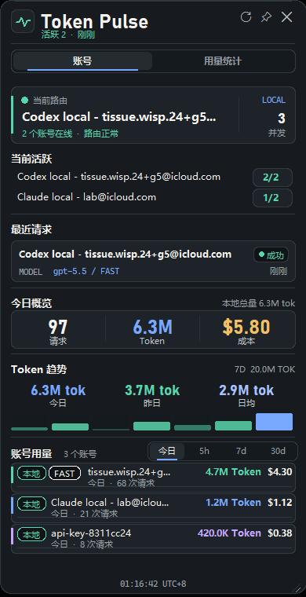

# Sub2API 桌面悬浮监控

一个轻量的 Windows 桌面悬浮窗，用来查看 Sub2API 当前活跃账号、并发、今日 token、成本统计，也可以在没有 Sub2API 的情况下读取本机 Codex/Claude 使用日志。



适合这些场景：

- 多个中转账号、OAuth 账号混合使用时，快速查看当前走的是哪个账号。
- 观察今日请求量、token、成本和账号排行。
- 排查 Codex 请求到底有没有经过 Sub2API。
- 没有 Sub2API 时，单独统计本机 Codex/Claude 日志。

## 功能

- Windows 桌面悬浮窗，支持置顶和拖动。
- 显示当前活跃账号、并发数量和最近请求。
- 显示今日请求数、token 数和估算成本。
- 显示账号排行，包括 token、成本、请求数和简单状态标记。
- 记录本地每日用量历史，用于查看今日、昨日和 7 日趋势。
- 支持读取本机 Codex/Claude JSONL 日志。
- 对 Codex 分叉会话做去重，减少重复上下文导致的统计膨胀。
- 底部显示 UTC+8 时间。

## 运行要求

- Windows
- Python 3.10+
- Tkinter，Windows 官方 Python 通常自带

不需要安装额外 Python 包。

## 快速开始

自动模式，优先读取 Sub2API，失败时回退到本地日志：

```powershell
.\start-monitor.ps1
```

只读取本机 Codex/Claude 日志：

```powershell
.\start-local-codex.ps1
```

也可以直接运行：

```powershell
python .\monitor.py
```

## Sub2API 模式

复制 `.env.example` 为 `.env`，然后填写你的本地 Sub2API 管理端配置：

```env
SUB2API_MONITOR_MODE=auto
SUB2API_BASE_URL=http://127.0.0.1:8080
SUB2API_ADMIN_EMAIL=admin@sub2api.local
SUB2API_ADMIN_PASSWORD=your-password
```

如果你希望必须连接 Sub2API，不允许回退到本地日志，可以设置：

```env
SUB2API_MONITOR_MODE=sub2api
```

如果你的 Sub2API 有多个本地访问地址，可以设置匹配地址：

```env
SUB2API_MATCH_BASE_URLS=http://127.0.0.1:8080,http://localhost:8080
```

## 本地 Codex 模式

本地模式会扫描：

- `%USERPROFILE%\.codex\sessions`
- `%USERPROFILE%\.claude\projects`

脚本会生成 `client_usage_today.json`，用于保存当天本地客户端统计。这个文件默认不提交到 Git。

悬浮窗还会生成 `usage_history.json`，用于保存每日请求、token 和成本快照。这个文件也默认不提交到 Git。如果想换位置，可以设置：

```env
SUB2API_USAGE_HISTORY_JSON=
```

常用配置：

```env
SUB2API_MONITOR_MODE=local-codex
CLIENT_USAGE_CODEX_DEFAULT_MODEL=gpt-5.5
CLIENT_USAGE_MAX_SINGLE_EVENT_TOKENS=2000000
SUB2API_INCLUDE_LOCAL_USAGE=false
SUB2API_MONITOR_USAGE_SOURCE=auto
```

`CLIENT_USAGE_MAX_SINGLE_EVENT_TOKENS` 用来过滤异常大的单次 token 事件。

## 统计来源

`SUB2API_MONITOR_USAGE_SOURCE` 支持：

- `auto`：自动检测当前 Codex endpoint。
- `sub2api`：只使用 Sub2API 服务端统计。
- `local`：只使用本地 Codex/Claude 日志。
- `both`：同时展示 Sub2API 服务端统计和本地日志，适合对账，但可能重复计算。

默认建议使用 `auto`。

当 Codex 指向你的 Sub2API 地址时，主统计来自 Sub2API。因为 Codex 即使走 Sub2API 也会写本地 token 日志，所以默认不会把本地日志直接合并到总量，避免重复计算。

## 分叉会话去重

Codex 分叉会话时，可能会把之前的上下文重新带入新会话。如果统计器把这些 replay 也算成新请求，今日 token 会明显膨胀。

本工具会检测 `session_meta.payload.forked_from_id`，跳过初始 replay 窗口，并对重复的 token total 做去重。

## 文件说明

- `monitor.py`：悬浮窗 UI 和 Sub2API/本地数据源读取逻辑。
- `client_usage_export.py`：本机 Codex/Claude JSONL 用量扫描器。
- `start-monitor.ps1`：自动模式启动脚本。
- `start-local-codex.ps1`：本地日志模式启动脚本。
- `run-monitor.cmd`：CMD 启动脚本。
- `run-client-usage-export.cmd`：单独导出本地用量 JSON。

## 隐私说明

本地模式只读取你电脑上的本地日志，不会上传到任何地方。

Sub2API 模式只请求你配置的 `SUB2API_BASE_URL`。
